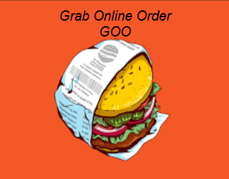

# GrabOnlineOrder (GOO)

**Developer:** Abhiram Gelle  
**GitHub:** [abhiramgelle1](https://github.com/abhiramgelle1)  
**Email:** abhiramgelle738@gmail.com  



## Overview

**GrabOnlineOrder (GOO)** is a full-stack **food ordering and delivery app** that connects customers with nearby restaurants through a seamless, real-time platform.  
It allows users to browse menus, place orders, make payments, and track deliveries—all in one intuitive mobile experience.  
The platform also offers dedicated dashboards for restaurant admins to manage menus, orders, and analytics.

---

## Motivation & Problem Statement

Traditional food ordering systems often involve:
- High delivery charges and hidden costs.  
- Long waiting times during peak hours.  
- Lack of real-time visibility for customers.  
- Inefficient restaurant order management.

**GOO** solves these problems by:
- Offering **transparent pricing** and **real-time tracking**.  
- Providing restaurants with **instant notifications** and **easy order management tools**.  
- Delivering a smooth user experience with an optimized backend and modern UI.

---

## Key Features

### User Features
- Account registration & authentication (Firebase/Auth API).  
- Location-based restaurant discovery.  
- Interactive restaurant & menu browsing with item details and photos.  
- Secure order placement and payment (Stripe/PayPal/Firebase).  
- Live order tracking via push notifications.  
- Order history & quick re-ordering.  
- Ratings, reviews, and feedback system.  
- Dark-theme enabled interface for better usability.

### Restaurant Admin Features
- Secure login for restaurant owners.  
- Dynamic menu management (add/edit/delete items).  
- Real-time order updates and notifications.  
- Order status control (Accepted → Preparing → Out for Delivery → Completed).  
- Sales analytics and performance dashboards.  
- Push alerts for new orders and customer feedback.

### Delivery Module (Optional)
- Delivery partner login.  
- View assigned orders and navigation via Google Maps.  
- Status updates (Picked Up, Out for Delivery, Delivered).  
- Daily summary and delivery history.

---

## Architecture & Technology Stack

| Layer | Technologies Used |
|-------|-------------------|
| **Frontend (Mobile)** | Flutter / Android Studio |
| **Backend** | Firebase / Node.js / Spring Boot (configurable) |
| **Database** | Firestore / MySQL |
| **Authentication** | Firebase Auth / JWT |
| **Storage** | Firebase Storage for menu images |
| **Notifications** | Firebase Cloud Messaging (FCM) |
| **Maps & Geolocation** | Google Maps SDK |
| **Payments** | Stripe / PayPal integration |
| **Version Control** | Git + GitHub |
| **Build Tools** | Gradle / Vite (for web admin panel if used) |

---

## System Flow

### User Journey
1. User logs in or signs up.  
2. GOO detects location and lists nearby restaurants.  
3. User selects restaurant → adds menu items → places order.  
4. Backend confirms order and notifies restaurant.  
5. Restaurant updates status and assigns delivery (if applicable).  
6. Delivery partner updates real-time tracking status.  
7. User receives order and can rate the service.

### System Diagram
```
User App ↔ REST API ↔ Database
                ↕
           Notification Service
                ↕
         Restaurant Dashboard
                ↕
          Delivery Module
```

---

## Database Design (Sample)

| Table / Collection | Key Fields |
|--------------------|------------|
| **Users** | userId, name, email, address, phone |
| **Restaurants** | restaurantId, name, location, cuisine, rating |
| **MenuItems** | itemId, restaurantId, name, description, price, imageUrl |
| **Orders** | orderId, userId, restaurantId, status, totalAmount, timestamp |
| **OrderItems** | orderItemId, orderId, itemId, quantity |
| **Reviews** | reviewId, userId, restaurantId, rating, comment |
| **DeliveryPersons** | deliveryId, name, location, assignedOrders |

---

## UI / UX Screens

| Module | Screens |
|---------|----------|
| **User** | Splash → Login/Signup → Home → Menu → Cart → Checkout → Order Tracking → Profile |
| **Admin** | Login → Dashboard → Menu Mgmt → Orders → Reports/Analytics |
| **Delivery (if included)** | Login → Assigned Orders → Map Navigation → Delivery Confirmation |

> The app follows **dark mode by default** with professional UI, proper padding, and grid layout consistency.

---

## Installation & Setup

### Prerequisites
- Android Studio with SDK (API Level ≥ 33)
- Java 11+ or Flutter SDK
- Firebase Project (for Auth, Firestore, FCM)
- Google Maps API Key
- Optional Payment Sandbox credentials

### Steps
```bash
# Clone this repository
git clone https://github.com/abhiramgelle1/GrabOnlineOrder-GOO.git

# Open in Android Studio or VS Code (Flutter)
cd GrabOnlineOrder-GOO

# Add your Firebase config
/app/google-services.json

# Add Maps & API keys in local.properties or .env

# Build the project
flutter pub get
flutter run
```

---

## Usage

### For Customers
1. Sign in and allow location access.  
2. Browse nearby restaurants and add items to your cart.  
3. Place order → pay → track live updates until delivery.  
4. Rate restaurant and items after completion.

### For Restaurants
1. Log into your admin dashboard.  
2. Add menu items and update availability.  
3. Accept or reject incoming orders.  
4. Mark items “preparing”, “ready”, or “out for delivery”.  
5. Review analytics to optimize operations.

### For Delivery Agents
1. Log in and view assigned orders.  
2. Navigate via integrated map.  
3. Update delivery status in real time.  
4. Confirm order hand-off.

---

## Testing

- **Unit Tests:** Validate order placement, status transitions, and payment flows.  
- **UI Tests:** Automated testing via Espresso / Flutter Integration Tests.  
- **Integration Tests:** Backend API and Firebase Firestore data sync.  
- **Manual Testing:** Network loss, duplicate order handling, and timeout scenarios.  
- **Performance Testing:** Simulate multiple concurrent orders.

---

## Future Enhancements

- iOS version of the GOO app.  
- Live chat between users, restaurants, and delivery partners.  
- Personalized recommendations using AI/ML.  
- Loyalty points and referral programs.  
- Real-time delivery tracking on map.  
- Multi-restaurant ordering support.  
- Admin-side staff and inventory management.  
- Offline-first architecture with data caching.

---

## Contributing

Contributions are welcome!  
1. Fork this repo  
2. Create a feature branch  
3. Commit your changes  
4. Submit a Pull Request  

Ensure your code follows standard linting, structure, and test coverage.

---

## Contact

**Abhiram Gelle**  
Email: [abhiramgelle738@gmail.com](mailto:abhiramgelle738@gmail.com)  
GitHub: [GitHub – abhiramgelle1](https://github.com/abhiramgelle1)  

> For issues or suggestions, please open a GitHub issue or connect via email.
